# Docker "Swarm Mode" Lab

Based on Mario's gist here: https://gist.github.com/l0rd/5186cc80f8f26dc7e9490abca4405830

# Requirements
- Docker 1.12
- Docker machine
- Virtualbox

# Create 3 nodes for your swarm cluster (one master and 2 slaves)

We will create 3 nodes using docker-machine/virtualbox.

#### NOTE:
You may see errors as below, and an error reported by "docker-machine ls", leave some time for the swmaster to settle.

In the meantime you can go ahead and create the 2 swnode's below.


```bash
. ../docker1.13.0.rc
```

Let's cleanup any remaining machines, if they exist already ..


```bash
docker-machine rm -f swmaster swnode1 swnode2
```

    About to remove swmaster, swnode1, swnode2
    Successfully removed swmaster
    Successfully removed swnode1
    Successfully removed swnode2


Now let's create our new nodes


```bash
docker-machine create -d virtualbox swmaster
```

    Running pre-create checks...
    Creating machine...
    (swmaster) Copying /home/mjb/.docker/machine/cache/boot2docker.iso to /home/mjb/.docker/machine/machines/swmaster/boot2docker.iso...
    (swmaster) Creating VirtualBox VM...
    (swmaster) Creating SSH key...
    (swmaster) Starting the VM...
    (swmaster) Check network to re-create if needed...
    (swmaster) Waiting for an IP...
    Waiting for machine to be running, this may take a few minutes...
    Detecting operating system of created instance...
    Waiting for SSH to be available...
    Detecting the provisioner...
    Provisioning with boot2docker...
    Copying certs to the local machine directory...
    Copying certs to the remote machine...
    Setting Docker configuration on the remote daemon...
    Checking connection to Docker...
    Docker is up and running!
    To see how to connect your Docker Client to the Docker Engine running on this virtual machine, run: docker-machine env swmaster


```bash
docker-machine ls
```

    NAME       ACTIVE   DRIVER       STATE     URL                         SWARM   DOCKER    ERRORS
    swmaster   -        virtualbox   Running   tcp://192.168.99.114:2376           v1.13.0   


```bash
docker-machine create -d virtualbox swnode1
```

    Running pre-create checks...
    Creating machine...
    (swnode1) Copying /home/mjb/.docker/machine/cache/boot2docker.iso to /home/mjb/.docker/machine/machines/swnode1/boot2docker.iso...
    (swnode1) Creating VirtualBox VM...
    (swnode1) Creating SSH key...
    (swnode1) Starting the VM...
    (swnode1) Check network to re-create if needed...
    (swnode1) Waiting for an IP...
    Waiting for machine to be running, this may take a few minutes...
    Detecting operating system of created instance...
    Waiting for SSH to be available...
    Detecting the provisioner...
    Provisioning with boot2docker...
    Copying certs to the local machine directory...
    Copying certs to the remote machine...
    Setting Docker configuration on the remote daemon...
    Checking connection to Docker...
    Docker is up and running!
    To see how to connect your Docker Client to the Docker Engine running on this virtual machine, run: docker-machine env swnode1


```bash
docker-machine ls
```

    NAME       ACTIVE   DRIVER       STATE     URL                         SWARM   DOCKER    ERRORS
    swmaster   -        virtualbox   Running   tcp://192.168.99.114:2376           v1.13.0   
    swnode1    -        virtualbox   Running   tcp://192.168.99.115:2376           v1.13.0   


```bash
time docker-machine create -d virtualbox swnode2
```

    Running pre-create checks...
    Creating machine...
    (swnode2) Copying /home/mjb/.docker/machine/cache/boot2docker.iso to /home/mjb/.docker/machine/machines/swnode2/boot2docker.iso...
    (swnode2) Creating VirtualBox VM...
    (swnode2) Creating SSH key...
    (swnode2) Starting the VM...
    (swnode2) Check network to re-create if needed...
    (swnode2) Waiting for an IP...
    Waiting for machine to be running, this may take a few minutes...
    Detecting operating system of created instance...
    Waiting for SSH to be available...
    Detecting the provisioner...
    Provisioning with boot2docker...
    Copying certs to the local machine directory...
    Copying certs to the remote machine...
    Setting Docker configuration on the remote daemon...
    Checking connection to Docker...
    Docker is up and running!
    To see how to connect your Docker Client to the Docker Engine running on this virtual machine, run: docker-machine env swnode2
    
    real	1m0.897s
    user	0m0.670s
    sys	0m0.053s


```bash
docker-machine ls
```

    NAME       ACTIVE   DRIVER       STATE     URL                         SWARM   DOCKER    ERRORS
    swmaster   -        virtualbox   Running   tcp://192.168.99.114:2376           v1.13.0   
    swnode1    -        virtualbox   Running   tcp://192.168.99.115:2376           v1.13.0   
    swnode2    -        virtualbox   Running   tcp://192.168.99.116:2376           v1.13.0   


# swarm init

Now that we have 3 nodes available, we will initialize our Swarm Cluster with 1 master node.

### Directing the docker client to a particular nodes' docker daemon
**NOTE**: See that we precede all docker commands with $(docker-machine config NODE) where node is the name of the node to which we want our docker client to connect to.  This command returns the parameters to direct our client to the appropriate node.  Run alone this produces:


```bash
docker-machine config swmaster
```

    --tlsverify
    --tlscacert="/home/mjb/.docker/machine/certs/ca.pem"
    --tlscert="/home/mjb/.docker/machine/certs/cert.pem"
    --tlskey="/home/mjb/.docker/machine/certs/key.pem"
    -H=tcp://192.168.99.114:2376


Including these parameters on the docker command line will connect the client to the docker daemon running on node '*swmaster*'.

### Networks before creation of swarm cluster
Before going further let's look at the networks on your machine.

Later, we'll see how a new network is created once the swarm cluster has been created.


```bash
docker $(docker-machine config swmaster) network ls
```

    NETWORK ID          NAME                DRIVER              SCOPE
    c7c01d8b70a3        bridge              bridge              local
    e16375837cfa        host                host                local
    f22f49175ae7        none                null                local


Now let's identify the ip address of our master node.

We can see this through config or ip commands of docker-machine as shown below.


```bash
docker-machine ip swmaster
```

    192.168.99.114


We could then provide the above ip address as parameter to --advertise-addr when initializing the swarm.

However, it is quite convenient to run the above commands embedded, as below, as arguments to the swarm init command.

docker-machine config swmaster provides the parameters to use when connecting to the appropriate docker engine for our machine "swmaster".

The following command will run swarm init to generate the cluster with 'swmaster' as the Master node.
You should see output similar to the below:


```bash
docker $(docker-machine config swmaster) swarm init --advertise-addr $(docker-machine ip swmaster)
```

    Swarm initialized: current node (r243hhgco052fasc7pen4v0ay) is now a manager.
    
    To add a worker to this swarm, run the following command:
    
        docker swarm join \
        --token SWMTKN-1-41zu4a0mditg8v6fj5s5l0s596c1l34q5ifun0q3fotel5jbmr-7km3aswq6nx3coc3vq317wjak \
        192.168.99.114:2377
    
    To add a manager to this swarm, run 'docker swarm join-token manager' and follow the instructions.
    


A docker info should now show "Swarm: active" as below:


```bash
docker $(docker-machine config swmaster) info
```

    Containers: 0
     Running: 0
     Paused: 0
     Stopped: 0
    Images: 0
    Server Version: 1.13.0
    Storage Driver: aufs
     Root Dir: /mnt/sda1/var/lib/docker/aufs
     Backing Filesystem: extfs
     Dirs: 0
     Dirperm1 Supported: true
    Logging Driver: json-file
    Cgroup Driver: cgroupfs
    Plugins: 
     Volume: local
     Network: bridge host macvlan null overlay
    Swarm: active
     NodeID: r243hhgco052fasc7pen4v0ay
     Is Manager: true
     ClusterID: vmgj75qogu29e4xnfnno9n2n0
     Managers: 1
     Nodes: 1
     Orchestration:
      Task History Retention Limit: 5
     Raft:
      Snapshot Interval: 10000
      Number of Old Snapshots to Retain: 0
      Heartbeat Tick: 1
      Election Tick: 3
     Dispatcher:
      Heartbeat Period: 5 seconds
     CA Configuration:
      Expiry Duration: 3 months
     Node Address: 192.168.99.114
     Manager Addresses:
      192.168.99.114:2377
    Runtimes: runc
    Default Runtime: runc
    Init Binary: docker-init
    containerd version: 03e5862ec0d8d3b3f750e19fca3ee367e13c090e
    runc version: 2f7393a47307a16f8cee44a37b262e8b81021e3e
    init version: 949e6fa
    Security Options:
     seccomp
      Profile: default
    Kernel Version: 4.4.43-boot2docker
    Operating System: Boot2Docker 1.13.0 (TCL 7.2); HEAD : 5b8d9cb - Wed Jan 18 18:50:40 UTC 2017
    OSType: linux
    Architecture: x86_64
    CPUs: 1
    Total Memory: 995.8 MiB
    Name: swmaster
    ID: A7MI:CIPN:M53F:W6UZ:FJKH:4P6H:SE2I:PSOE:SWOZ:I2EO:XGAX:UHW4
    Docker Root Dir: /mnt/sda1/var/lib/docker
    Debug Mode (client): false
    Debug Mode (server): true
     File Descriptors: 32
     Goroutines: 124
     System Time: 2017-01-25T20:22:05.60989371Z
     EventsListeners: 0
    Username: mjbright
    Registry: https://index.docker.io/v1/
    Labels:
     provider=virtualbox
    Experimental: false
    Insecure Registries:
     127.0.0.0/8
    Live Restore Enabled: false


If we look at the networks we should now see new networks such as '*ingress*' an overlay network and docker_gwbridge for the swarm cluster.


```bash
docker $(docker-machine config swmaster) network ls
```

    NETWORK ID          NAME                DRIVER              SCOPE
    c7c01d8b70a3        bridge              bridge              local
    32597262f84d        docker_gwbridge     bridge              local
    e16375837cfa        host                host                local
    cysk2wkjtjca        ingress             overlay             swarm
    f22f49175ae7        none                null                local


# swarm join

Now we wish to join Master and Worker nodes to our swarm cluster, to do this we need to obtain the token generated during the "swarm init".

Let's save that token to an environment variable as follows:


```bash
token=$(docker $(docker-machine config swmaster) swarm join-token worker -q)
```


```bash
echo $token
```

    SWMTKN-1-41zu4a0mditg8v6fj5s5l0s596c1l34q5ifun0q3fotel5jbmr-7km3aswq6nx3coc3vq317wjak


Now we can use this token to join nodes as a worker to this cluster

Note: we could also join nodes as Master, but we have only 3 nodes available.

Let's join swnode1 as a worker node


```bash
docker $(docker-machine config swnode1) swarm join --token $token $(docker-machine ip swmaster):2377
```

    This node joined a swarm as a worker.


Now we can use the same token to join node swnode2 as a worker node


```bash
docker $(docker-machine config swnode2) swarm join --token $token $(docker-machine ip swmaster):2377
```

    This node joined a swarm as a worker.


# start service

First we check for any running services - there should be none in our newly initialized cluster:


```bash
docker $(docker-machine config swmaster) service ls
```

    ID  NAME  MODE  REPLICAS  IMAGE


Now we will create a new service based on the docker image mariolet/docker-demo

We will expose this service on port 8080


```bash
docker $(docker-machine config swmaster) service create --replicas 1 --name docker-demo -p 8080:8080 mariolet/docker-demo:20
```

    z6yi30k1yqedhutcspzxisbkt


Now we list services again and we should see our newly added docker-demo service


```bash
docker $(docker-machine config swmaster) service ls
```

    ID            NAME         MODE        REPLICAS  IMAGE
    z6yi30k1yqed  docker-demo  replicated  0/1       mariolet/docker-demo:20


... and we can look at the service as seen by the cluster:


```bash
docker $(docker-machine config swmaster) service ps docker-demo
```

    ID            NAME           IMAGE                    NODE     DESIRED STATE  CURRENT STATE            ERROR  PORTS
    sac0v5i5beuj  docker-demo.1  mariolet/docker-demo:20  swnode2  Running        Preparing 4 seconds ago         


... and we can look at the service on the individual cluster nodes.

Of course as we set replicas to 1 there is only 1 replica of the service for the moment, running on just 1 node of our cluster:


```bash
docker $(docker-machine config swmaster) ps
```

    CONTAINER ID        IMAGE               COMMAND             CREATED             STATUS              PORTS               NAMES


```bash
docker $(docker-machine config swnode1) ps
```

    CONTAINER ID        IMAGE               COMMAND             CREATED             STATUS              PORTS               NAMES


```bash
docker $(docker-machine config swnode2) ps
```

    CONTAINER ID        IMAGE                                                                                          COMMAND                  CREATED             STATUS              PORTS               NAMES
    ac7f4401b6fc        mariolet/docker-demo@sha256:4721f179882cd7a84c42893046be38da94b59dc4b8a3dae56277d7b7b04a96cb   "/bin/docker-demo ..."   3 seconds ago       Up 2 seconds        8080/tcp            docker-demo.1.sac0v5i5beujxbydzq6dsix35


# Accessing the service

As we are working remotely we need to create an ssh tunnel through to the swarm cluster to access our service, exposing the port 8080 on your local machine.

We can obtain the ip address of the swarm master node as follows.


```bash
docker-machine ip swmaster
```

    192.168.99.114


So from a terminal on your laptop open the ssh tunnel to **YOUR USER@YOUR SERVER**

MYSERVER=10.3.222.32
MYUSER=group20

e.g. ssh group20@10.3.222.32 -L 8080:192.168.99.114:8080 -Nv


```bash
MYSERVER=10.3.222.32
MYUSER=group20
ssh ${MYUSER}@${MYSERVER} -L 8080:$(docker-machine ip swmaster):8080 -Nv
```

    OpenSSH_7.2p2, OpenSSL 1.0.2j-fips  26 Sep 2016
    debug1: Reading configuration data /home/mjb/.ssh/config
    debug1: Reading configuration data /etc/ssh/ssh_config
    debug1: /etc/ssh/ssh_config line 58: Applying options for *
    debug1: Connecting to 10.3.222.32 [10.3.222.32] port 22.
    


Then open your web browser at the page http://localhost:8080 and you should see a lovely blue whale, as below:


# scale service

Now we can scale the service to 3 replicas:


```bash
docker $(docker-machine config swmaster) service scale docker-demo=3
```

    docker-demo scaled to 3


```bash
docker $(docker-machine config swmaster) service ps docker-demo
```

    ID            NAME           IMAGE                    NODE      DESIRED STATE  CURRENT STATE                     ERROR  PORTS
    sac0v5i5beuj  docker-demo.1  mariolet/docker-demo:20  swnode2   Running        Running 51 seconds ago                   
    bffp3nyo685u  docker-demo.2  mariolet/docker-demo:20  swmaster  Running        Preparing less than a second ago         
    de9h34g8oipr  docker-demo.3  mariolet/docker-demo:20  swnode1   Running        Preparing less than a second ago         


# rolling-update

Now we will see how we can perform a rolling update.

We initially deployed version 20 of the service, now we will upgrade our whole cluster to version 20 


```bash
docker $(docker-machine config swmaster) service ps docker-demo
```

    ID            NAME           IMAGE                    NODE      DESIRED STATE  CURRENT STATE               ERROR  PORTS
    sac0v5i5beuj  docker-demo.1  mariolet/docker-demo:20  swnode2   Running        Running about a minute ago         
    bffp3nyo685u  docker-demo.2  mariolet/docker-demo:20  swmaster  Running        Running 11 seconds ago             
    de9h34g8oipr  docker-demo.3  mariolet/docker-demo:20  swnode1   Running        Running 9 seconds ago              


```bash
docker $(docker-machine config swmaster) service update --image mariolet/docker-demo:21 docker-demo
```

    docker-demo


```bash
docker $(docker-machine config swmaster) service ps docker-demo
```

    ID            NAME               IMAGE                    NODE      DESIRED STATE  CURRENT STATE                    ERROR  PORTS
    sac0v5i5beuj  docker-demo.1      mariolet/docker-demo:20  swnode2   Running        Running about a minute ago              
    camjztgdrvfw  docker-demo.2      mariolet/docker-demo:21  swmaster  Running        Preparing 1 second ago                  
    bffp3nyo685u   \_ docker-demo.2  mariolet/docker-demo:20  swmaster  Shutdown       Shutdown less than a second ago         
    de9h34g8oipr  docker-demo.3      mariolet/docker-demo:20  swnode1   Running        Running 19 seconds ago                  


```bash
docker $(docker-machine config swmaster) service ps docker-demo
```

    ID            NAME               IMAGE                    NODE      DESIRED STATE  CURRENT STATE            ERROR  PORTS
    b53mbjpbq8ec  docker-demo.1      mariolet/docker-demo:21  swnode2   Running        Running 1 second ago            
    sac0v5i5beuj   \_ docker-demo.1  mariolet/docker-demo:20  swnode2   Shutdown       Shutdown 4 seconds ago          
    camjztgdrvfw  docker-demo.2      mariolet/docker-demo:21  swmaster  Running        Running 9 seconds ago           
    bffp3nyo685u   \_ docker-demo.2  mariolet/docker-demo:20  swmaster  Shutdown       Shutdown 11 seconds ago         
    y49fxa2bn10a  docker-demo.3      mariolet/docker-demo:21  swnode1   Running        Running 6 seconds ago           
    de9h34g8oipr   \_ docker-demo.3  mariolet/docker-demo:20  swnode1   Shutdown       Shutdown 8 seconds ago          


### Verifying the service has been updated

Then open your web browser at the page http://localhost:8080 and you should now see a lovely **red** whale.


# drain a node

We can drain a node effectively placing it in 'maintenance mode'.

Draining a node means that it no longer has running tasks on it.


```bash
docker $(docker-machine config swmaster) node ls
```

    ID                           HOSTNAME  STATUS  AVAILABILITY  MANAGER STATUS
    2acz1rh2cogtd657qro9k71je    swnode1   Ready   Active        
    jvh0bcaevz9g9cgtm76hkamt0    swnode2   Ready   Active        
    r243hhgco052fasc7pen4v0ay *  swmaster  Ready   Active        Leader


Let's drain swnode1


```bash
docker $(docker-machine config swmaster) service ps docker-demo
```

    ID            NAME               IMAGE                    NODE      DESIRED STATE  CURRENT STATE            ERROR  PORTS
    b53mbjpbq8ec  docker-demo.1      mariolet/docker-demo:21  swnode2   Running        Running 12 seconds ago          
    sac0v5i5beuj   \_ docker-demo.1  mariolet/docker-demo:20  swnode2   Shutdown       Shutdown 15 seconds ago         
    camjztgdrvfw  docker-demo.2      mariolet/docker-demo:21  swmaster  Running        Running 20 seconds ago          
    bffp3nyo685u   \_ docker-demo.2  mariolet/docker-demo:20  swmaster  Shutdown       Shutdown 22 seconds ago         
    y49fxa2bn10a  docker-demo.3      mariolet/docker-demo:21  swnode1   Running        Running 16 seconds ago          
    de9h34g8oipr   \_ docker-demo.3  mariolet/docker-demo:20  swnode1   Shutdown       Shutdown 19 seconds ago         


```bash
docker $(docker-machine config swmaster) node update --availability drain swnode1
```

    swnode1


and now we see that all services on swnode1 are shutdown


```bash
docker $(docker-machine config swmaster) service ps docker-demo
```

    ID            NAME               IMAGE                    NODE      DESIRED STATE  CURRENT STATE                    ERROR  PORTS
    b53mbjpbq8ec  docker-demo.1      mariolet/docker-demo:21  swnode2   Running        Running 18 seconds ago                  
    sac0v5i5beuj   \_ docker-demo.1  mariolet/docker-demo:20  swnode2   Shutdown       Shutdown 21 seconds ago                 
    camjztgdrvfw  docker-demo.2      mariolet/docker-demo:21  swmaster  Running        Running 26 seconds ago                  
    bffp3nyo685u   \_ docker-demo.2  mariolet/docker-demo:20  swmaster  Shutdown       Shutdown 28 seconds ago                 
    hbk811izheg8  docker-demo.3      mariolet/docker-demo:21  swmaster  Running        Running less than a second ago          
    y49fxa2bn10a   \_ docker-demo.3  mariolet/docker-demo:21  swnode1   Shutdown       Shutdown less than a second ago         
    de9h34g8oipr   \_ docker-demo.3  mariolet/docker-demo:20  swnode1   Shutdown       Shutdown 24 seconds ago                 


```bash
docker $(docker-machine config swmaster) service ps docker-demo
```

    ID            NAME               IMAGE                    NODE      DESIRED STATE  CURRENT STATE            ERROR  PORTS
    b53mbjpbq8ec  docker-demo.1      mariolet/docker-demo:21  swnode2   Running        Running 20 seconds ago          
    sac0v5i5beuj   \_ docker-demo.1  mariolet/docker-demo:20  swnode2   Shutdown       Shutdown 23 seconds ago         
    camjztgdrvfw  docker-demo.2      mariolet/docker-demo:21  swmaster  Running        Running 28 seconds ago          
    bffp3nyo685u   \_ docker-demo.2  mariolet/docker-demo:20  swmaster  Shutdown       Shutdown 30 seconds ago         
    hbk811izheg8  docker-demo.3      mariolet/docker-demo:21  swmaster  Running        Running 3 seconds ago           
    y49fxa2bn10a   \_ docker-demo.3  mariolet/docker-demo:21  swnode1   Shutdown       Shutdown 3 seconds ago          
    de9h34g8oipr   \_ docker-demo.3  mariolet/docker-demo:20  swnode1   Shutdown       Shutdown 27 seconds ago         


# remove a service

Now let's cleanup by removing our service


```bash
docker $(docker-machine config swmaster) service rm docker-demo
```

    docker-demo


We can check that the service is no longer running:


```bash
docker $(docker-machine config swmaster) service ps docker-demo
```

    Error: No such service: docker-demo


```bash
docker $(docker-machine config swmaster) ps
```

    CONTAINER ID        IMAGE               COMMAND             CREATED             STATUS              PORTS               NAMES


```bash

```
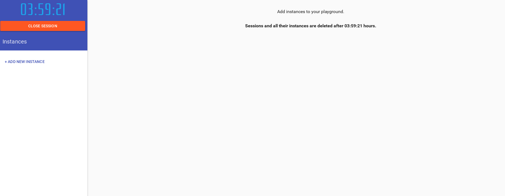
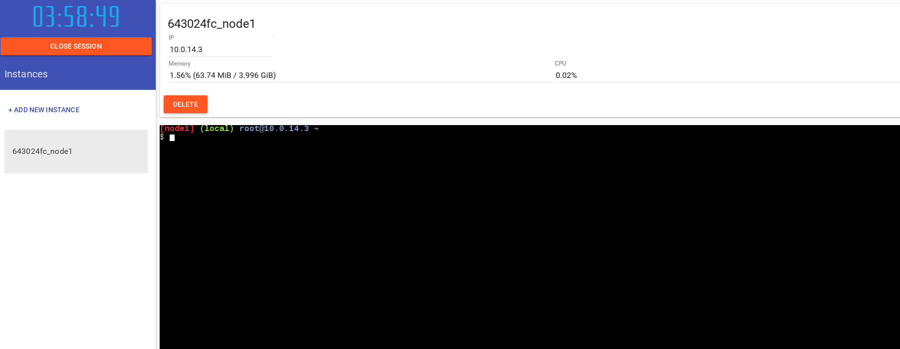
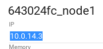
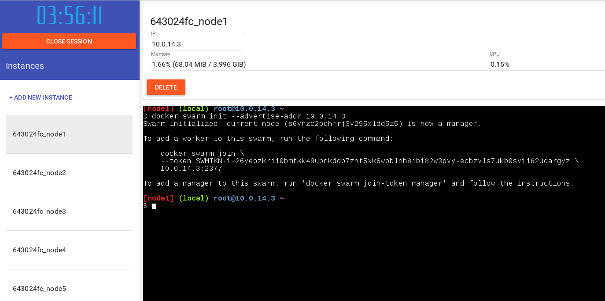


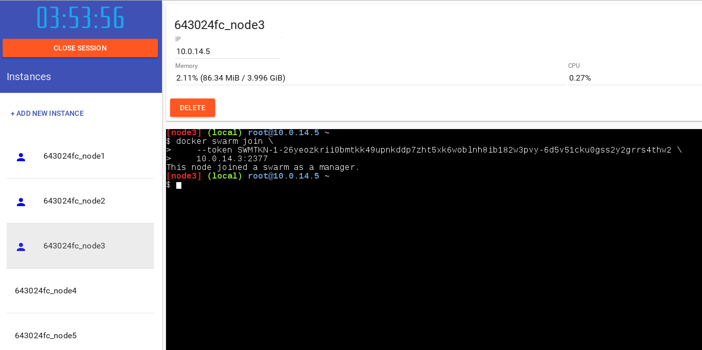

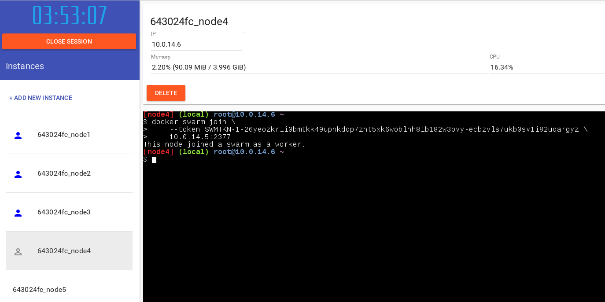
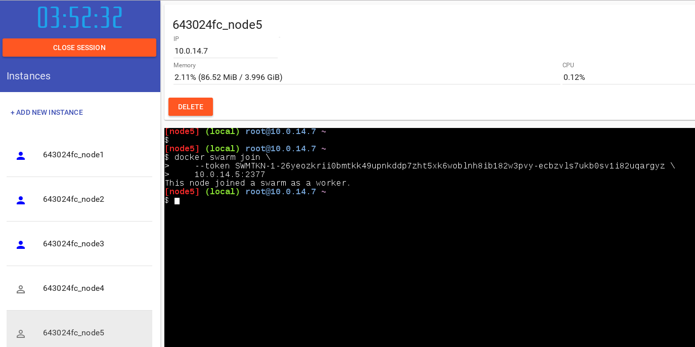


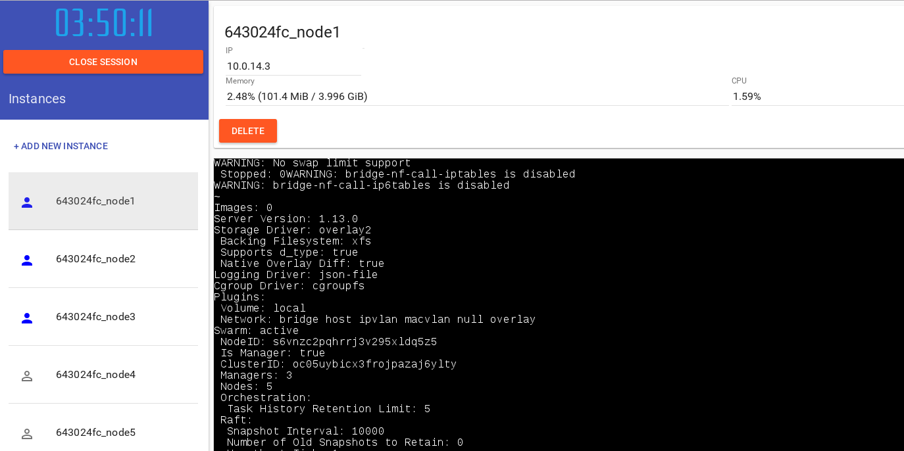
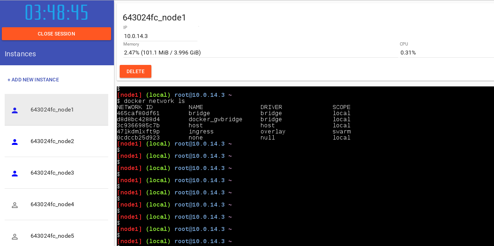
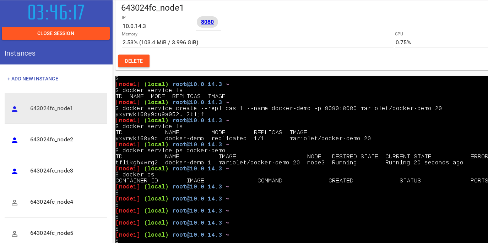
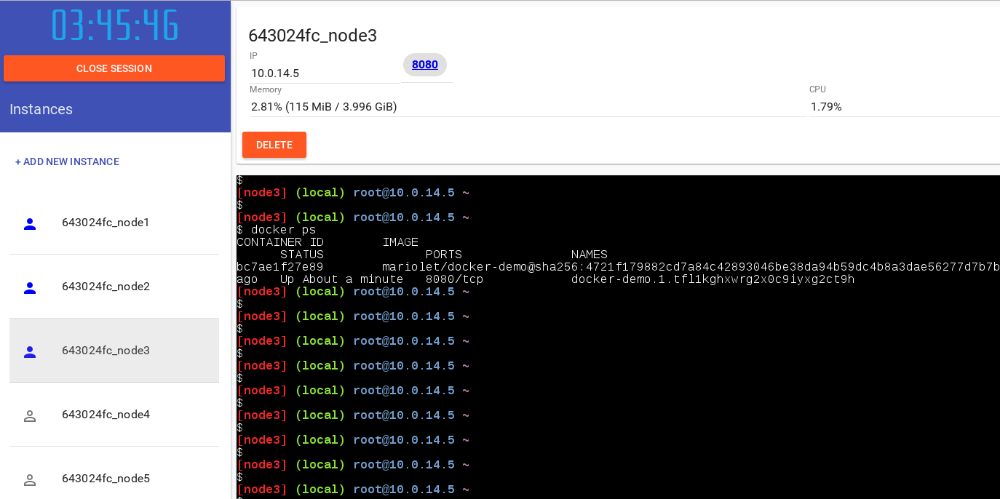
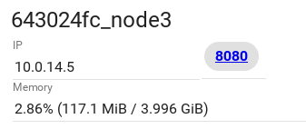
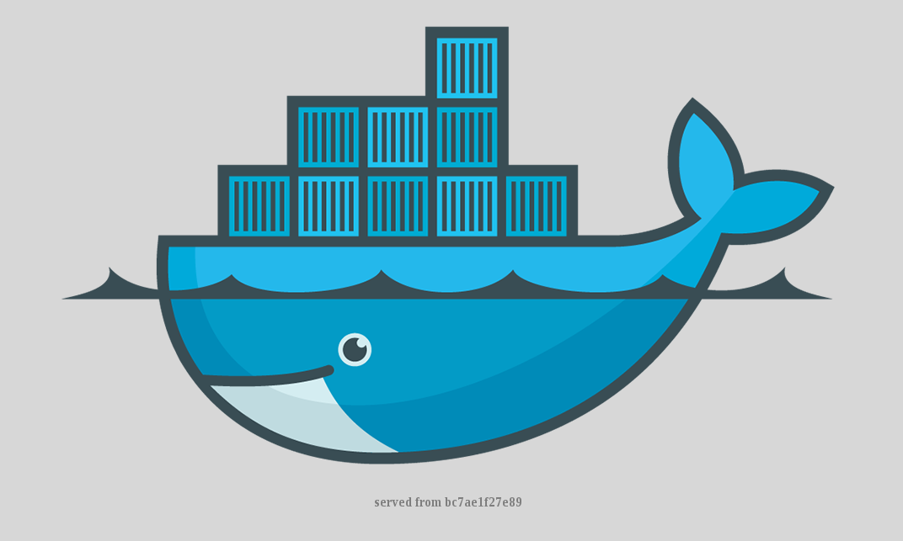

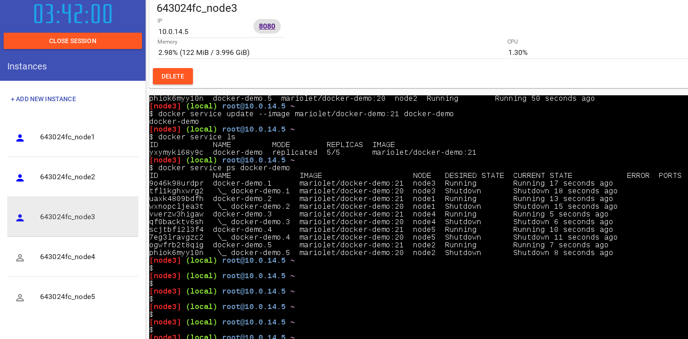
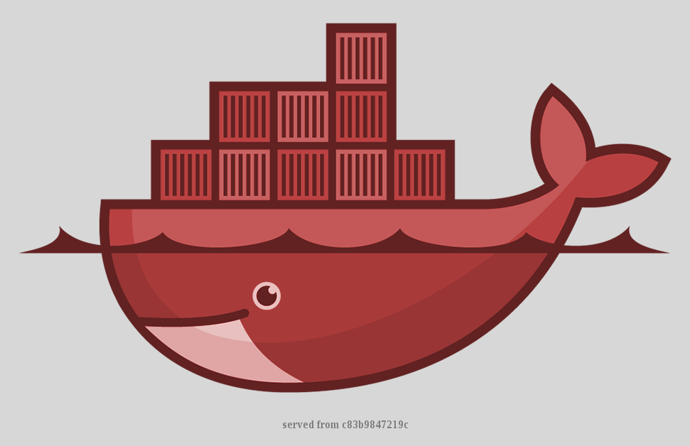
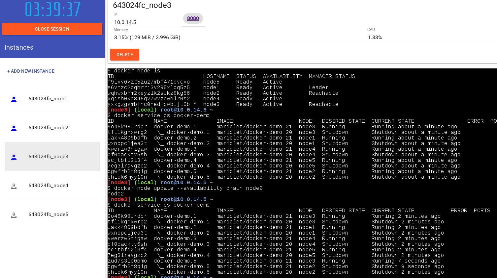

