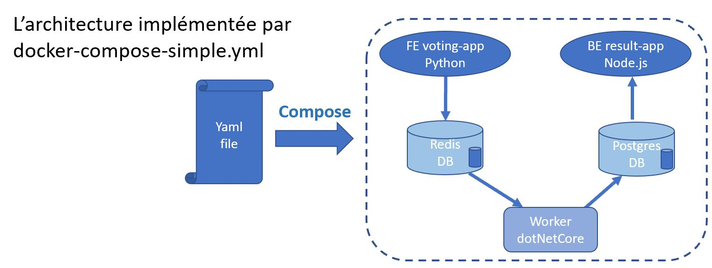
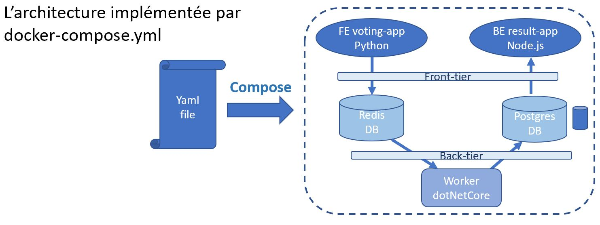

# TP7: Docker Compose

You can find the official documentation for '*Docker Compose*' here: [https://docs.docker.com/compose/](https://docs.docker.com/compose/)

The source code for '*Docker Compose*' is available here: [https://github.com/docker/compose](https://github.com/docker/compose)

## 1. Connect to the Play-with-Docker environment

For this lab I propose to use a new environment, an environment in the cloud called "Play with Docker".

Open a browser window at https://labs.play-with-docker.com.

Connect to your account.

Once logged in you will see that our environment is available for 4 hours, we see the countdown timer.
So beware that all work you do here will be lost.

Click on the **"+ ADD NEW INSTANCE"** button


This will create a new Docker host for us.

From this host verify that you can run some commands:
```
docker version
docker container run --rm hello-world
docker image ls
```

**All commands in this page should be typed into the terminal of play-with-docker.**

**NOTE:** It is also possible to connect to the play-with-docker environment by ssh

(the ssh command is provided for you in the page).

## 2. Download docker-compose

In fact we do not need to do this as the latest docker-compose is already installed in this environment.

## 2.1 Download docker-compose bash-completion

```bash
sudo curl -L https://raw.githubusercontent.com/docker/compose/1.22.0/contrib/completion/bash/docker-compose -o /etc/bash_completion.d/docker-compose
```

Now enable the bash completion and test that it works:
```
. /etc/bash_completion.d/docker-compose
```

Test by typing:
```
docker-compose v<TAB>
```

The command should auto-complete to
```
docker-compose version
```

## 3. Using docker-compose

To see what version you have installed
```
docker-compose version
```

you should see something similar to:
```
$ docker-compose version
docker-compose version 1.23.0-rc3, build ea3d406e
docker-py version: 3.5.0
CPython version: 3.6.6
OpenSSL version: OpenSSL 1.1.0f  25 May 2017
```

## 3.1 Recuperate the example voting app

For this lab I propose to use a new environment, an environment in the cloud called "Play with Docker"
```
mkdir ~/src
cd    ~/src
git clone https://github.com/dockersamples/example-voting-app
```

Go to the directory where you downloaded the source for the voting-app and list the YAML (\*.yml) files there
```
cd example-voting-app
ls *.yml
```

e.g.
```
[node1] (local) root@192.168.0.22 ~/src/example-voting-app
$ ls -al *.yml
-rw-r--r--    1 root     root           808 Nov  9 07:34 docker-compose-javaworker.yml
-rw-r--r--    1 root     root           517 Nov  9 07:34 docker-compose-k8s.yml
-rw-r--r--    1 root     root           400 Nov  9 07:34 docker-compose-simple.yml
-rw-r--r--    1 root     root          1107 Nov  9 07:34 docker-compose-windows-1809.yml
-rw-r--r--    1 root     root           994 Nov  9 07:34 docker-compose-windows.yml
-rw-r--r--    1 root     root           808 Nov  9 07:34 docker-compose.yml
-rw-r--r--    1 root     root          1435 Nov  9 07:34 docker-stack-simple.yml
-rw-r--r--    1 root     root          1037 Nov  9 07:34 docker-stack-windows-1809.yml
-rw-r--r--    1 root     root          1284 Nov  9 07:34 docker-stack-windows.yml
-rw-r--r--    1 root     root          1666 Nov  9 07:34 docker-stack.yml
-rw-r--r--    1 root     root          3201 Nov  9 07:34 kube-deployment.yml
```

We see that there are many docker compose files.

For this lab we are interested in:
- docker-compose-simple.yml
- docker-compose.yml
- docker-compose-windows.yml

#### 3.1.1 Docker-compose-simple

This is the simplest architecture proposed.

We have a micro-service implementation of a voting application with 5 elements.

In the diagram we can see that there are 2 front-end applications
- the voting 



Examine the file docker-compose-simple.yml to see what services are present and how they are configured.

Experiment with some of the preparatory commands:
```
docker-compose -f docker-compose-simple.yml config
docker-compose -f docker-compose-simple.yml pull
docker-compose -f docker-compose-simple.yml build
```
**NOTE:** normally these are performed by the docker-compose run

Now launch the application in detached mode with
```
docker-compose -f docker-compose-simple.yml up -d
```

You should now see some links appear at the top of the Play-with-docker page allowing access to the voting app (port 5000) and the results app (port 5001).

Click on them to try the app.


You can check the logs of all running services with
```
docker-compose -f docker-compose-simple.yml logs
```

Or a specific service, such as vote here:
```
docker-compose -f docker-compose-simple.yml logs vote
```

Or follow the logs with option -f  (follow)
```
docker-compose -f docker-compose-simple.yml logs -f vote
```

Now stop the application using:
```
docker-compose -f docker-compose-simple.yml down
```

#### 3.1.2 Docker-compose

This version is more elaborate, in particular we see that it creates some dedicated networks between components and a volume for Postgres.



Compare this with the docker-compose-simple.yml

Start this new version with
```
docker-compose up -d
```

**NOTE:** this time no need to specify the docker-compose file as by default docker-compose.yml or docker-compose.yaml are used.

#### 3.1.3 Docker-compose-windows

This version cannot be run on Play-with-docker or on a Linux Docker Engine.

It can be run on Docker Desktop for Windows only if 'Windows Containers' mode is enabled.

You are invited to
- study the docker-compose-windows.yml file to see how it compares to the previous docker-compose.yml
- If running Docker Desktop for Windows, swithc to 'Windows Containers' and try ```docker-compose -f docker-compose-windows.yml up -d```


